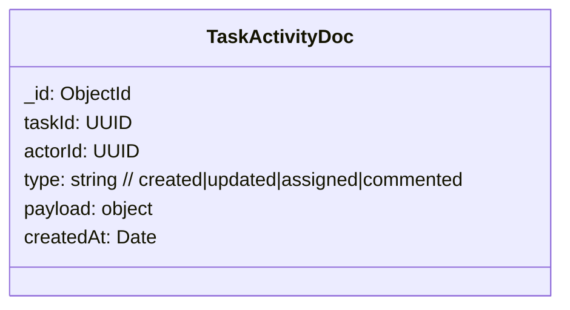
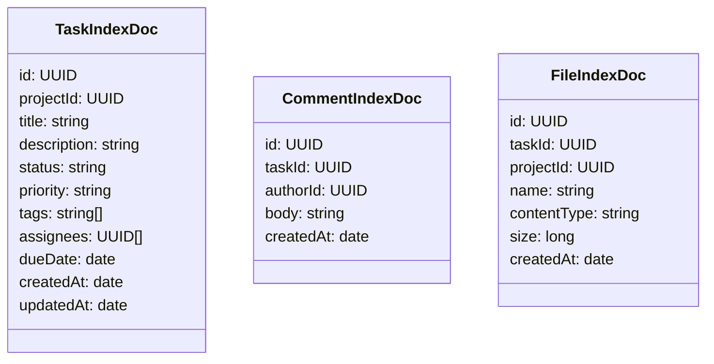

# Схемы NoSQL (MongoDB, Redis, Elasticsearch)

## MongoDB (аудит/история)

- Коллекции: `task_activity` (шардинг по `taskId`).
- Индексы: `{ taskId: 1, createdAt: -1 }`.

## Redis (кэш/сессии/ключи идемпотентности)
- Ключи:
  - `idemp:{service}:{key}` -> TTL 24h
  - `session:{userId}` -> JWT meta, TTL 1h
  - `task:list:{projectId}:{filtersHash}` -> страницы результатов, TTL 5m

## Elasticsearch/OpenSearch (поиск)

- Анализаторы: ru/en, edge_ngram для подсказок, стоп-слова, синонимы.
- Политика обновления: upsert по событиям `task.*`, `comment.added`, `file.uploaded`.
