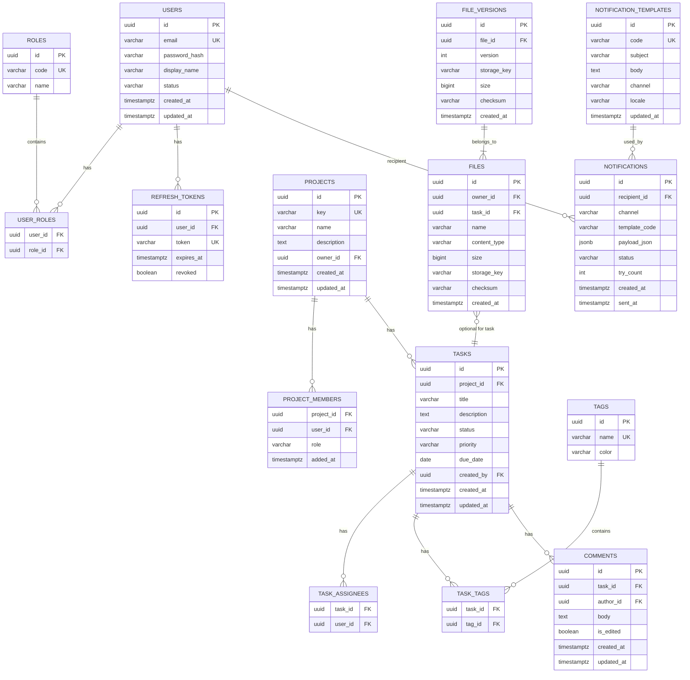

# Схемы реляционных БД (PostgreSQL)

Ниже приведены ключевые таблицы для доменов Users, Projects, Tasks, Comments, Files, Notifications, Reporting.

## ER-диаграмма (Mermaid)

## Ключевые ограничения и индексы
- Уникальные: `users.email`, `roles.code`, `projects.key`, `tags.name`.
- Внешние ключи: каскадное удаление для связей many-to-many по потребности, soft-delete обсуждается отдельно.
- Индексы:
  - `tasks(project_id, status, due_date)`, `comments(task_id, created_at)`
  - `files(task_id, created_at)`, `notifications(recipient_id, created_at)`

## Таблицы и поля (описания)
- USERS.status: active/locked/deleted.
- TASKS.status: backlog/todo/in_progress/in_review/done/cancelled.
- TASKS.priority: low/medium/high/urgent.
- NOTIFICATIONS.status: pending/sent/failed.

## Миграции
- Использовать Flyway/EF Migrations; версии — атомарные изменения с обратимостью.
- Все изменения сопровождать измерением влияния на планы запросов.
