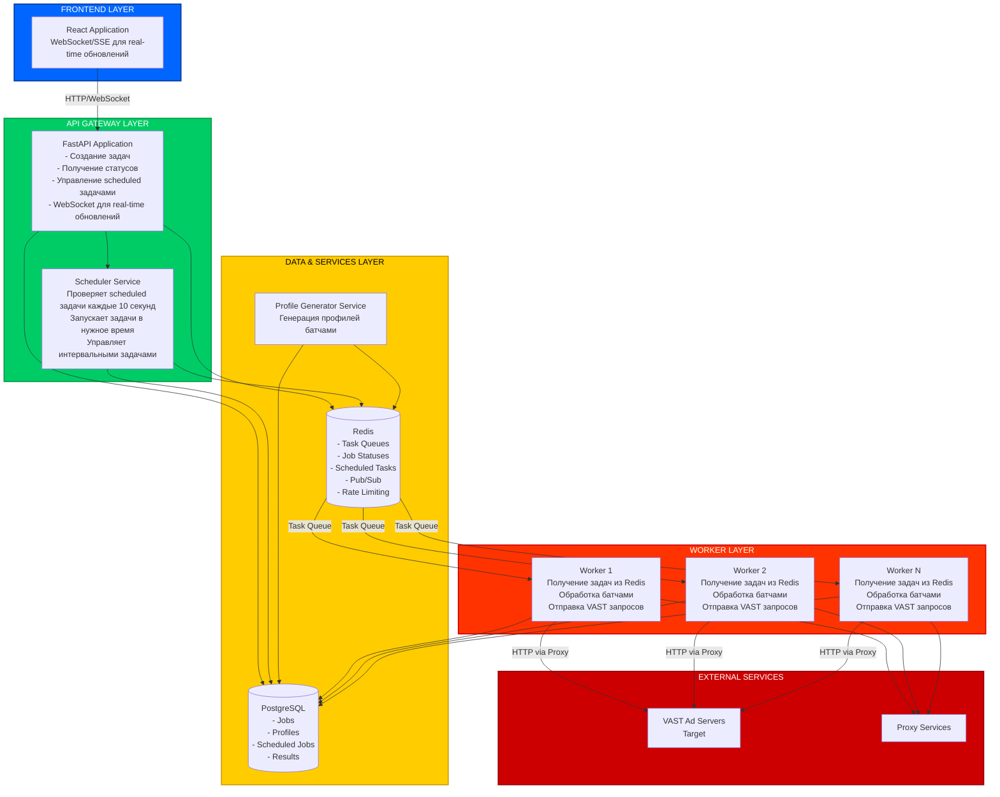

```mermaid
graph TB
    subgraph Frontend["FRONTEND LAYER"]
        React[React Application<br/>WebSocket/SSE для real-time обновлений]
    end

    subgraph API["API GATEWAY LAYER"]
        FastAPI[FastAPI Application<br/>- Создание задач<br/>- Получение статусов<br/>- Управление scheduled задачами<br/>- WebSocket для real-time обновлений]
        Scheduler[Scheduler Service<br/>Проверяет scheduled задачи каждые 10 секунд<br/>Запускает задачи в нужное время<br/>Управляет интервальными задачами]
    end

    subgraph Data["DATA & SERVICES LAYER"]
        PostgreSQL[(PostgreSQL<br/>- Jobs<br/>- Profiles<br/>- Scheduled Jobs<br/>- Results)]
        Redis[(Redis<br/>- Task Queues<br/>- Job Statuses<br/>- Scheduled Tasks<br/>- Pub/Sub<br/>- Rate Limiting)]
        ProfileGen[Profile Generator Service<br/>Генерация профилей батчами]
    end

    subgraph Workers["WORKER LAYER"]
        Worker1[Worker 1<br/>Получение задач из Redis<br/>Обработка батчами<br/>Отправка VAST запросов]
        Worker2[Worker 2<br/>Получение задач из Redis<br/>Обработка батчами<br/>Отправка VAST запросов]
        WorkerN[Worker N<br/>Получение задач из Redis<br/>Обработка батчами<br/>Отправка VAST запросов]
    end

    subgraph External["EXTERNAL SERVICES"]
        VAST[VAST Ad Servers<br/>Target]
        Proxy[Proxy Services]
    end

    React -->|HTTP/WebSocket| FastAPI
    FastAPI --> PostgreSQL
    FastAPI --> Redis
    FastAPI --> Scheduler
    Scheduler --> PostgreSQL
    Scheduler --> Redis
    ProfileGen --> PostgreSQL
    ProfileGen --> Redis
    Redis -->|Task Queue| Worker1
    Redis -->|Task Queue| Worker2
    Redis -->|Task Queue| WorkerN
    Worker1 --> PostgreSQL
    Worker2 --> PostgreSQL
    WorkerN --> PostgreSQL
    Worker1 -->|HTTP via Proxy| VAST
    Worker2 -->|HTTP via Proxy| VAST
    WorkerN -->|HTTP via Proxy| VAST
    Worker1 --> Proxy
    Worker2 --> Proxy
    WorkerN --> Proxy

    style Frontend fill:#0066FF,stroke:#003399,stroke-width:2px,color:#FFFFFF
    style API fill:#00CC66,stroke:#009944,stroke-width:2px,color:#FFFFFF
    style Data fill:#FFCC00,stroke:#CC9900,stroke-width:2px,color:#000000
    style Workers fill:#FF3300,stroke:#CC0000,stroke-width:2px,color:#FFFFFF
    style External fill:#CC0000,stroke:#990000,stroke-width:2px,color:#FFFFFF
```
