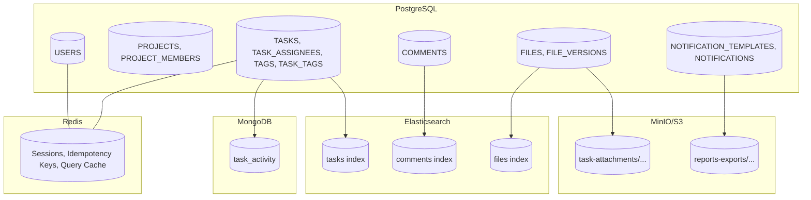
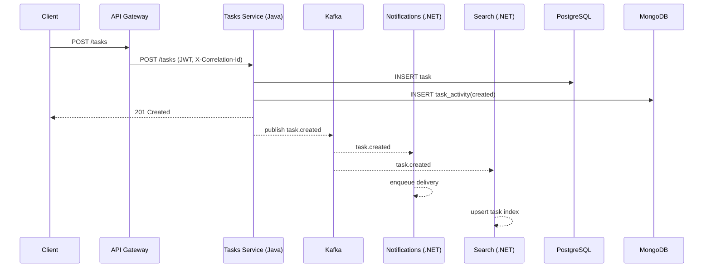
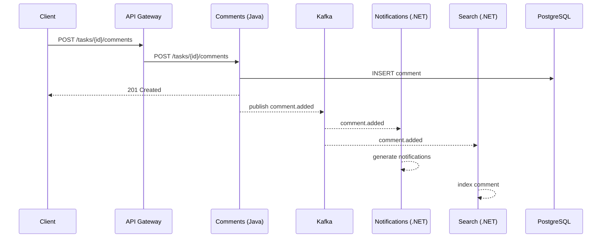
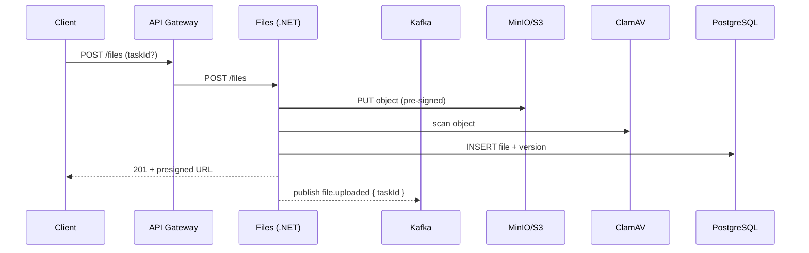

# Межсервисное взаимодействие (диаграммы)

## Расширенная архитектурная диаграмма (включая инфраструктуру)
```mermaid
flowchart LR
  %% Клиенты и периметр
  subgraph CLIENTS[Clients]
    WEB[Web App]
    MOBILE[Mobile App]
  end

  subgraph EDGE[Edge]
    CDN[CDN]
    GW[API Gateway / OIDC Proxy]
  end

  CLIENTS --> CDN --> GW
  MOBILE --> GW

  %% Доменные сервисы (Java)
  subgraph JAVA[Domain Services (Java)]
    AUTH[Auth/Identity (Java)]
    PROJ[Projects (Java)]
    TASKS[Tasks (Java)]
    COMM[Comments (Java)]
  end

  %% Доменные сервисы (.NET)
  subgraph DOTNET[Domain Services (.NET)]
    FILES[Files (.NET)]
    NOTIF[Notifications (.NET)]
    SEARCH[Search (.NET)]
    REPORT[Reporting (.NET)]
  end

  %% Сообщения
  subgraph MSG[Messaging]
    KAFKA[(Kafka Cluster)]
  end

  %% Хранилища данных
  subgraph DATA[Data Stores]
    PG[(PostgreSQL)]
    MONGO[(MongoDB)]
    REDIS[(Redis)]
    ES[(Elasticsearch/OpenSearch)]
    MINIO[(MinIO/S3 Object Storage)]
  end

  %% Внешние интеграции
  subgraph EXT[External Integrations]
    SMTP[(SMTP Email)]
    WEBPUSH[(Web Push Service)]
    CLAMAV[(ClamAV Antivirus)]
  end

  %% Наблюдаемость
  subgraph OBS[Observability]
    OTEL[OpenTelemetry Collector]
    PROM[(Prometheus)]
    GRAF[Grafana]
    LOGS[(ELK/EFK)]
  end

  %% Связи с периметра
  GW --> AUTH
  GW --> PROJ
  GW --> TASKS
  GW --> COMM
  GW --> FILES
  GW --> NOTIF
  GW --> SEARCH
  GW --> REPORT

  %% Java сервисы -> данные/сообщения
  AUTH --> PG
  AUTH --> REDIS
  PROJ --> PG
  TASKS --> PG
  TASKS --> MONGO
  TASKS --> REDIS
  COMM --> PG

  %% .NET сервисы -> данные/интеграции
  FILES --> MINIO
  FILES --> PG
  FILES --> REDIS
  FILES --> CLAMAV
  NOTIF --> PG
  NOTIF --> REDIS
  NOTIF --> SMTP
  NOTIF --> WEBPUSH
  SEARCH --> ES
  REPORT --> PG
  REPORT --> ES
  REPORT --> MINIO

  %% События (publish)
  TASKS -- "task.created | task.updated | task.assigned" --> KAFKA
  COMM -- "comment.added" --> KAFKA
  FILES -- "file.uploaded | file.version_added" --> KAFKA
  NOTIF -- "notification.sent" --> KAFKA

  %% События (consume)
  SEARCH -- consumes --> KAFKA
  NOTIF -- consumes --> KAFKA
  REPORT -- consumes --> KAFKA

  %% Observability wiring
  AUTH --> OTEL
  PROJ --> OTEL
  TASKS --> OTEL
  COMM --> OTEL
  FILES --> OTEL
  NOTIF --> OTEL
  SEARCH --> OTEL
  REPORT --> OTEL
  GW --> OTEL

  OTEL --> PROM
  OTEL --> LOGS
  GRAF --- PROM
```

### Легенда
- Кластеры DATA, MSG, OBS группируют инфраструктуру.
- Направленные стрелки показывают синхронные вызовы; стрелки к Kafka — публикацию событий; пометка consumes — подписка.
- MinIO используется для бинарных файлов и экспортов отчётов, PostgreSQL — для OLTP, MongoDB — для истории/аудита, Redis — для кэшей/сессий/идемпотентности, Elasticsearch — для поиска.

---

## Карта хранилищ (что и где хранится)


---

## Последовательность: создание задачи


## Последовательность: комментарий к задаче


## Последовательность: загрузка файла

