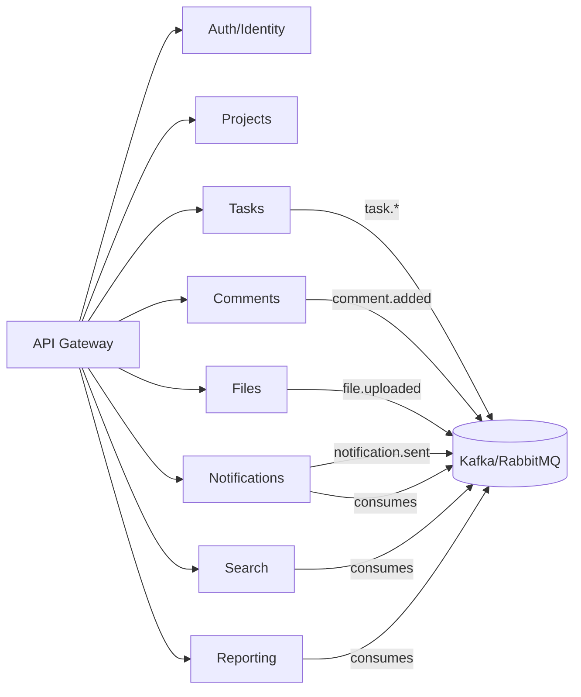
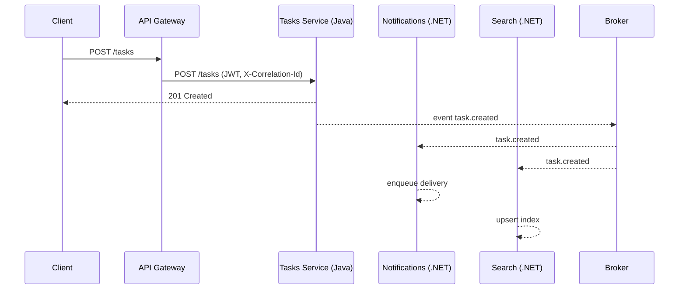
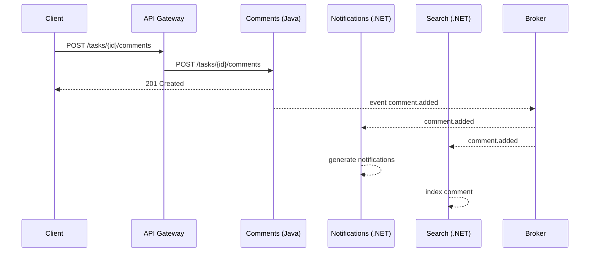
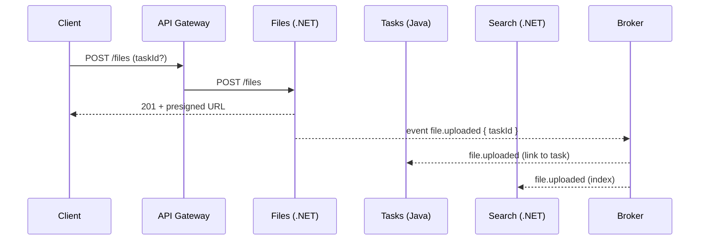

# Межсервисное взаимодействие (диаграммы)

## Контекстная диаграмма (C4-like)

## Последовательность: создание задачи

## Последовательность: комментарий к задаче

## Последовательность: загрузка файла

