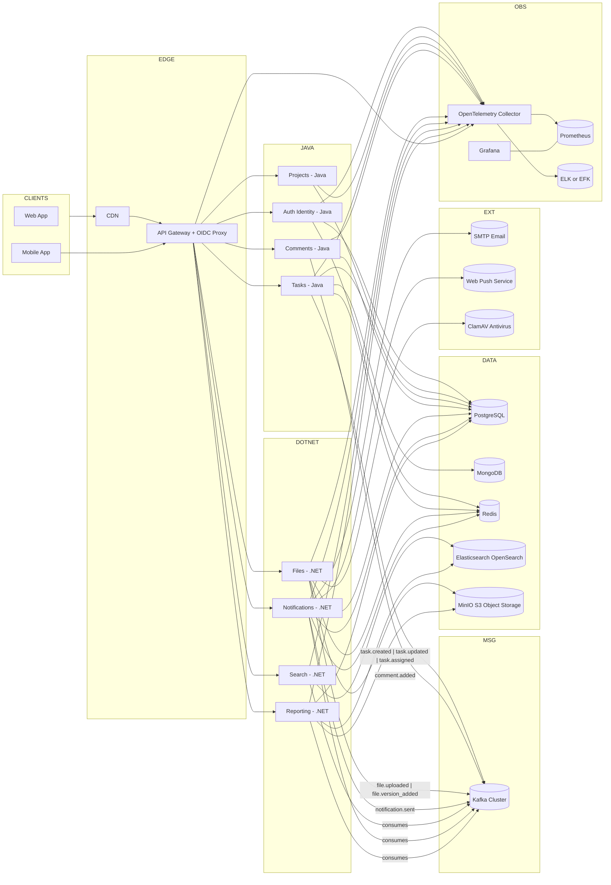
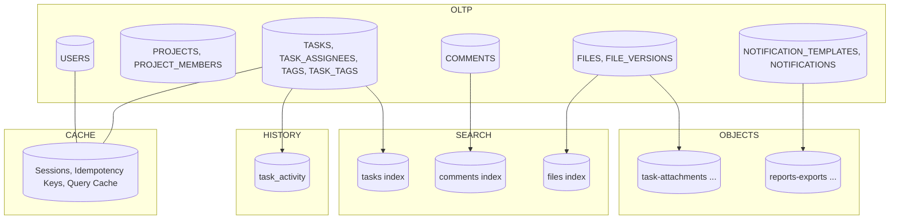
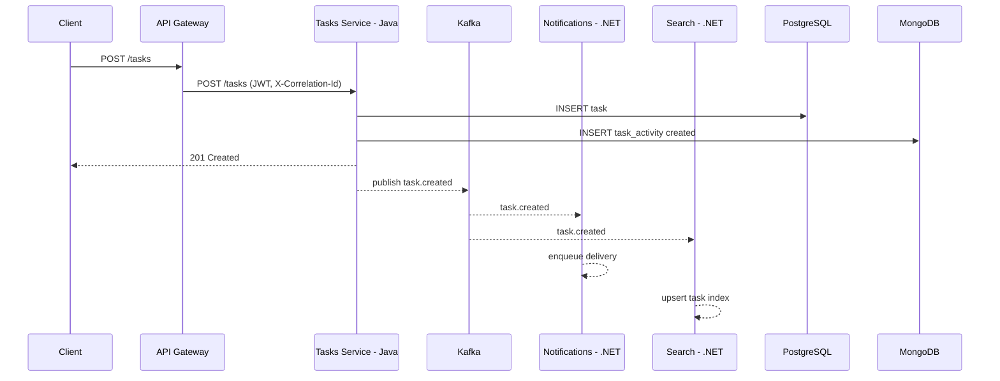
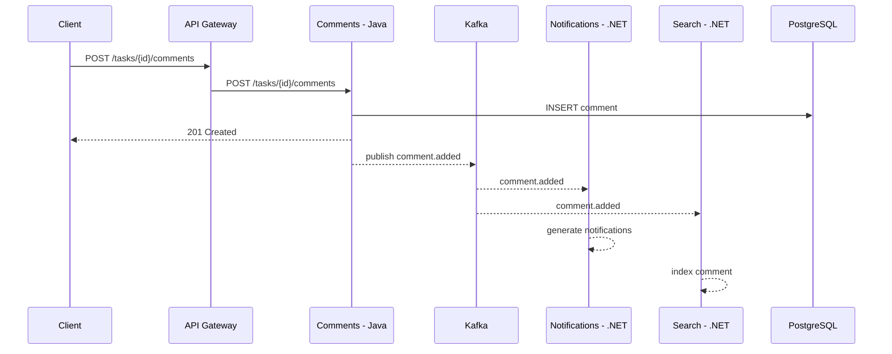

# Межсервисное взаимодействие (диаграммы)

## Расширенная архитектурная диаграмма (включая инфраструктуру)

### Легенда
- Кластеры DATA, MSG, OBS группируют инфраструктуру.
- Направленные стрелки показывают синхронные вызовы; стрелки к Kafka — публикацию событий; пометка consumes — подписка.
- MinIO используется для бинарных файлов и экспортов отчётов, PostgreSQL — для OLTP, MongoDB — для истории и аудита, Redis — для кэшей, сессий и идемпотентности, Elasticsearch — для поиска.

---

## Карта хранилищ (что и где хранится)

---

## Последовательность: создание задачи

## Последовательность: комментарий к задаче

## Последовательность: загрузка файла

### Детализация по хранилищам

- PostgreSQL (OLTP)
  - Основные сущности: `USERS`, `PROJECTS`, `PROJECT_MEMBERS`, `TASKS`, `TASK_ASSIGNEES`, `TAGS`, `TASK_TAGS`, `COMMENTS`, `FILES`, `FILE_VERSIONS`, `NOTIFICATION_TEMPLATES`, `NOTIFICATIONS`.
  - Индексация:
    - `TASKS(project_id, status, due_date)`, `TASKS(title) GIN trigram при необходимости`
    - `COMMENTS(task_id, created_at)`
    - `FILES(task_id, created_at)`, `USERS(email) UNIQUE`, `PROJECTS(key) UNIQUE`, `TAGS(name) UNIQUE`
  - Паттерны доступа: транзакционные CRUD, пагинация, фильтры по проекту/статусу/исполнителю, join'ы по справочникам.
  - Ретеншн: основное долгосрочное хранение; soft-delete по потребности.
  - Бэкапы: ежедневные snapshot'ы + point-in-time recovery; тест восстановления ежемесячно.
  - Владелец: команды Java (.Java) и .NET сервисов, через свои схемы/роли.

- MongoDB (История/аудит)
  - Коллекции: `task_activity` (события жизненного цикла задач).
  - Индексация: `{ taskId: 1, createdAt: -1 }`, шардирование по `taskId` при росте.
  - Паттерны доступа: аппенды при изменениях, чтение лент активности по `taskId`.
  - Ретеншн: 18 месяцев (конфигурируемо), далее архив или удаление.
  - Бэкапы: бэкап на уровне кластера + периодические дампы коллекции.
  - Владелец: Tasks (Java).

- Redis (Кэш/сессии/идемпотентность)
  - Ключи: `session:{userId}`, `idemp:{service}:{key}`, `task:list:{projectId}:{filtersHash}`.
  - Индексация: не применяется; TTL: 1h для сессий, 24h для идемпотентности, 5m для списков.
  - Паттерны доступа: get/set, инвалидация по событиям, ограничения частоты.
  - Ретеншн: краткосрочно, только кэш и служебные ключи.
  - Бэкапы: не критично; AOF/RDB по профилю эксплуатации.
  - Владелец: все сервисы как клиенты; операционный владелец — платформа.

- Elasticsearch/OpenSearch (Поиск)
  - Индексы: `tasks`, `comments`, `files`.
  - Схемы документов: см. `db-nosql.md` (TaskIndexDoc, CommentIndexDoc, FileIndexDoc).
  - Анализаторы: ru/en, edge_ngram для автодополнения, синонимы.
  - Паттерны доступа: upsert по событиям `task.*`, `comment.added`, `file.uploaded`; запросы полнотекста с фильтрами.
  - Ретеншн: 12 месяцев для `comments`, 24 месяца для `tasks`/`files` (регулируемо ILM).
  - Бэкапы: snapshot в объектное хранилище по расписанию.
  - Владелец: Search (.NET).

- MinIO/S3 (Объектное хранилище)
  - Бакеты: `task-attachments`, `reports-exports`.
  - Ключи: `task-attachments/{projectId}/{taskId}/{fileId}/{version}`, `reports-exports/{reportId}/{ts}`.
  - Паттерны доступа: pre-signed URL для загрузки/скачивания; серверная валидация.
  - Ретеншн: версии файлов — согласно политике проекта; отчёты — 30 дней.
  - Бэкапы: версионирование + репликация бакета между зонами.
  - Владелец: Files (.NET), Reporting (.NET) для экспортов.
